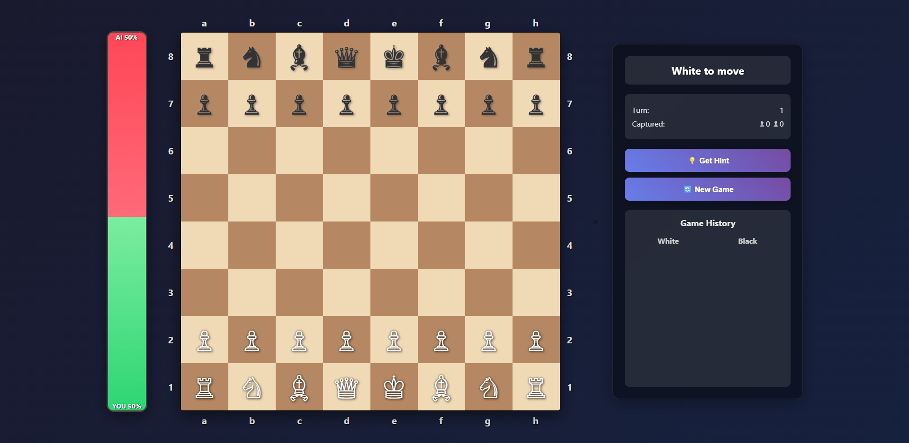

# Chess Game

Demo at [pingvortex.github.io/chess/](https://pingvortex.github.io/chess/)

A modern, interactive chess game built with HTML, CSS, and JavaScript. Play against an AI opponent with win probability tracking, move hints, and game history.

## Features

- **Interactive Chess Board**: Play with standard chess rules and piece movements
- **AI Opponent**: Computer makes strategic moves with varying difficulty
- **Win Probability Tracker**: Visual bar showing current winning chances
- **Move Hints**: Get suggestions for your next move
- **Game History**: Track all moves made during the game
- **Responsive Design**: Clean, modern interface with smooth animations
- **Win Tracking**: Local storage keeps track of your total wins

## How to Play

1. Click on any of your pieces (white) to select it
2. Valid moves will be highlighted on the board
3. Click on a highlighted square to move your piece
4. The AI will automatically make its move after yours
5. Use the "Get Hint" button for move suggestions
6. Start a new game anytime with the "New Game" button

## Technical Details

- Pure JavaScript implementation of chess rules
- AI uses move evaluation with material, position, and king safety considerations
- Estimated Elo of AI is 600
- Win probability calculation based on board state analysis
- Local storage for tracking win statistics
- CSS animations for smooth piece movement and highlights

## Future Improvements

- Add difficulty levels for the AI
- Add sound effects
- Create a mobile-friendly version

Enjoy the game!
